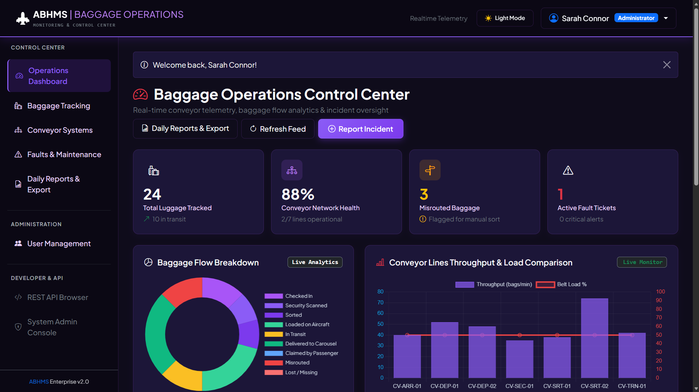
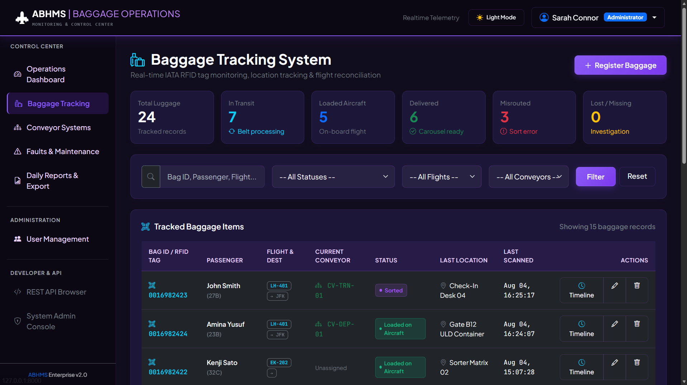
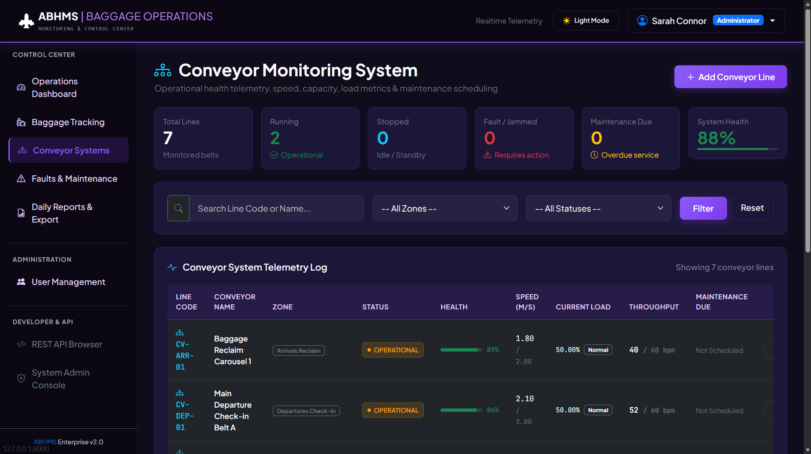
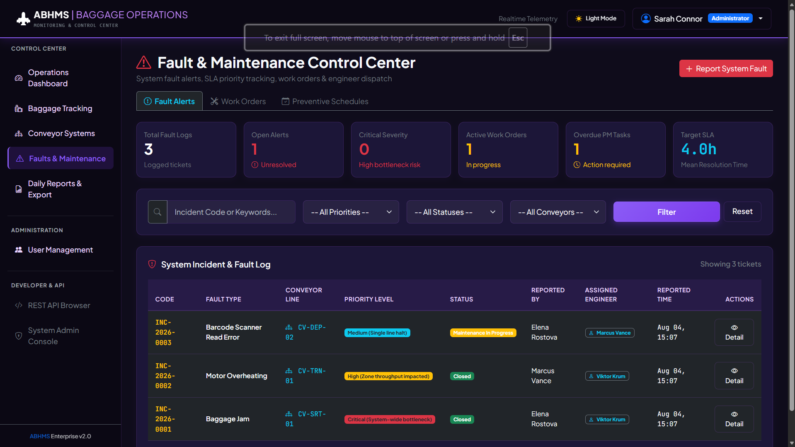
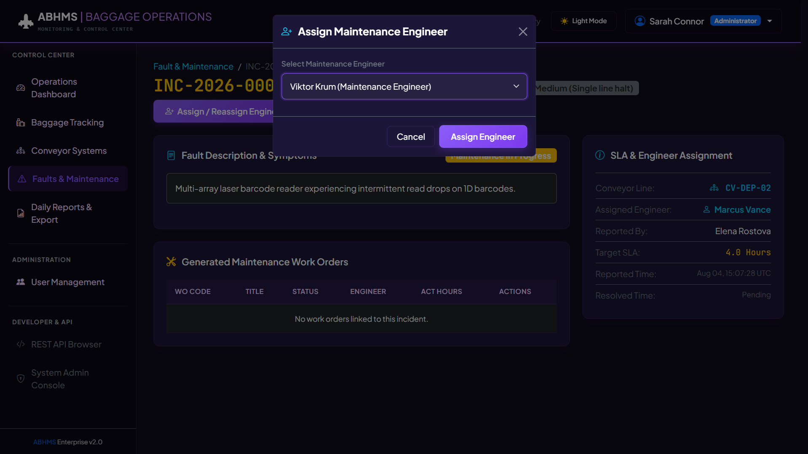
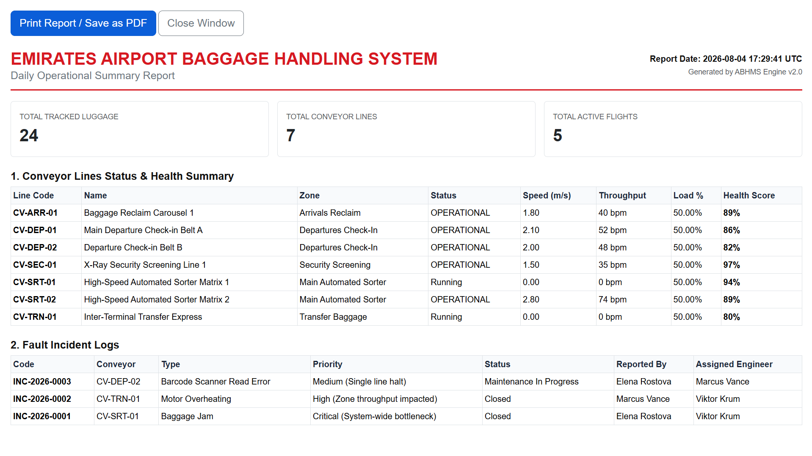

# ✈️ Airport Baggage Handling Monitoring System

### Airport Operations • Baggage Tracking • Conveyor Monitoring • Maintenance Management

A web-based **Airport Baggage Handling Monitoring System (ABHMS)** designed to simulate the monitoring and operational management of an airport baggage handling environment.

The system provides a centralized dashboard for monitoring baggage movement, conveyor infrastructure, operational faults, maintenance activities, and airport performance indicators.

> **Project Type:** Enterprise / Airport Automation Proof of Work
> **Domain:** Airport Baggage Handling & Operations
> **Implementation:** Full-stack web application
> **Data:** Simulated operational data

---

## 🎯 Project Objective

Modern airports depend on automated baggage handling infrastructure to move, sort, scan, and deliver passenger baggage efficiently.

This project demonstrates how a centralized software platform can be used to monitor such an environment by connecting:

**Flights → Baggage → Scanners → Conveyors → Sorting Areas → Maintenance**

The objective was to build a realistic operational monitoring platform rather than a conventional CRUD-based inventory application.

---

# 🏗️ System Architecture

```text
                    ┌─────────────────────┐
                    │      Airport        │
                    │     Operations      │
                    └──────────┬──────────┘
                               │
                               ▼
                    ┌─────────────────────┐
                    │     Web Dashboard   │
                    └──────────┬──────────┘
                               │
             ┌─────────────────┼─────────────────┐
             │                 │                 │
             ▼                 ▼                 ▼
      Baggage Tracking   Conveyor Monitor   Fault Monitor
             │                 │                 │
             └─────────────────┼─────────────────┘
                               │
                               ▼
                    ┌─────────────────────┐
                    │   Django Backend    │
                    │   REST API Layer    │
                    └──────────┬──────────┘
                               │
                               ▼
                    ┌─────────────────────┐
                    │     PostgreSQL      │
                    │      Database       │
                    └─────────────────────┘
```

---

# 🚀 Key Features

## 1. Airport Operations Dashboard

The main dashboard provides an overview of the airport baggage handling environment.

### Monitoring indicators

* Total baggage processed
* Active conveyors
* Conveyor faults
* Delayed baggage
* Active maintenance tasks
* Scanner status
* System health

The dashboard allows operators and supervisors to quickly identify operational problems.

---

## 2. Baggage Tracking

Each baggage item is assigned a unique identifier and can be tracked through different stages of the baggage handling process.

### Example lifecycle

```text
Checked In
     ↓
Security Screening
     ↓
Sorting
     ↓
Assigned to Conveyor
     ↓
Make-up Area
     ↓
Loading
     ↓
Aircraft
```

The system maintains the current location and status of each baggage item.

---

## 3. Conveyor Monitoring

The system provides centralized monitoring of baggage conveyors.

Each conveyor can contain information such as:

* Conveyor ID
* Location
* Terminal
* Current status
* Operating speed
* Capacity
* Current load
* Health status
* Maintenance status

### Conveyor states

```text
🟢 RUNNING
🟡 BUSY
🔴 FAULT
⚫ OFFLINE
```

---

## 4. Scanner Monitoring

Barcode/scanning equipment can be monitored through the system.

The monitoring interface provides information such as:

* Scanner status
* Number of scans
* Failed scans
* Last activity
* Associated conveyor
* Fault status

---

## 5. Fault Management

Operational faults can be reported and monitored.

### Example faults

* Conveyor Jam
* Motor Failure
* Scanner Offline
* Barcode Read Failure
* Emergency Stop
* Belt Fault
* Communication Failure

Each incident can be assigned a priority and responsible maintenance engineer.

---

## 6. Maintenance Management

The system supports preventive and corrective maintenance workflows.

### Workflow

```text
Fault / Maintenance Due
          ↓
Create Maintenance Task
          ↓
Assign Engineer
          ↓
Inspection
          ↓
Repair / Maintenance
          ↓
Verification
          ↓
Task Completed
```

Maintenance history can be associated with individual airport assets.

---

## 7. Flight Management

Flights can be associated with baggage handling operations.

Example:

```text
Flight: AI-123
Destination: Dubai
Terminal: T2

Bags:
├── Checked In: 142
├── Sorting: 37
├── Loading: 81
└── Completed: 24
```

This creates a relationship between flight operations and baggage movement.

---

# 📊 Operational Analytics

The system provides visual analytics for operational decision-making.

### Example KPIs

* Baggage throughput
* Conveyor utilization
* Fault frequency
* Average fault resolution time
* Delayed baggage
* Scanner failures
* Maintenance workload
* Equipment availability

Charts and dashboards help supervisors identify operational trends.

---

# 👥 User Roles

The system can support different operational roles.

| Role                  | Access                            |
| --------------------- | --------------------------------- |
| Administrator         | Full system access                |
| Operations Supervisor | Monitoring & reports              |
| Operator              | Baggage & conveyor monitoring     |
| Maintenance Engineer  | Faults & maintenance              |
| Auditor               | Read-only operational information |

---

# 🗄️ Data Model

The primary entities include:

```text
User
 │
 ├── Employee
 │
 └── Role

Airport
 │
 └── Terminal
       │
       ├── Conveyor
       │      └── Scanner
       │
       └── Sorting Area

Flight
 │
 └── Baggage
        │
        └── Baggage Movement

Conveyor
 │
 ├── Fault
 │
 └── Maintenance Task
```

---

# 🛠️ Technology Stack

### Backend

* Python
* Django
* Django REST Framework

### Database

* PostgreSQL

### Frontend

* HTML5
* CSS3
* JavaScript
* Bootstrap

### Visualization

* Chart.js
* Interactive operational dashboards

### Development

* Git
* GitHub
* REST APIs

---

# 🔄 System Workflow

```text
                     FLIGHT
                       │
                       ▼
                Baggage Check-in
                       │
                       ▼
                Security Screening
                       │
                       ▼
                 Barcode Scanner
                       │
                       ▼
              Baggage Sorting System
                       │
                       ▼
                   Conveyor
                       │
              ┌────────┴────────┐
              ▼                 ▼
          Normal Flow          Fault
              │                 │
              ▼                 ▼
        Loading Area       Fault Ticket
              │                 │
              ▼                 ▼
          Aircraft       Maintenance Team
```

---

# 📸 Project Screenshots

Screenshots are provided as the primary demonstration of the system.

## Dashboard



## Baggage Tracking



## Conveyor Monitoring



## Fault Management



## Maintenance



## Analytics



---

# 📁 Repository Structure

This repository is intentionally structured as a **project showcase / proof-of-work repository** rather than a source-code repository.

```text
airport-baggage-handling-monitoring/
│
├── README.md
│
├── screenshots/
│   ├── dashboard.png
│   ├── baggage-tracking.png
│   ├── conveyor-monitoring.png
│   ├── fault-management.png
│   ├── maintenance.png
│   └── analytics.png
│
├── architecture/
│   ├── system-architecture.png
│   ├── database-architecture.png
│   └── workflow.png
│
├── demo/
│   └── system-demo.mp4
│
└── docs/
    ├── project-overview.pdf
    └── technical-documentation.pdf
```

> **Note:** The repository contains project documentation and outputs for demonstration purposes. The underlying application source code and production configuration are not included.

---

# 🧩 Implementation Approach

The system was developed incrementally using a modular architecture.

### Step 1 — Requirement Analysis

Identified the primary airport baggage handling entities:

* Flights
* Baggage
* Conveyors
* Scanners
* Faults
* Maintenance
* Employees
* Operational metrics

### Step 2 — Database Design

Defined relationships between operational entities.

For example:

```text
Flight
  ↓
Baggage
  ↓
Scanner
  ↓
Conveyor
  ↓
Sorting Area
```

### Step 3 — Backend Development

Implemented:

* Django models
* CRUD operations
* REST APIs
* Authentication
* Role-based permissions
* Business logic
* Data validation

### Step 4 — Frontend Development

Created:

* Operational dashboard
* Baggage tracking interface
* Conveyor monitoring
* Fault management
* Maintenance interface
* Analytics pages

### Step 5 — Operational Simulation

Because real airport equipment and PLC infrastructure are not available in a portfolio environment, operational events are represented using simulated data.

Examples include:

```text
Conveyor → RUNNING
Conveyor → FAULT
Scanner → OFFLINE
Bag → SORTING
Bag → LOADING
Maintenance → IN PROGRESS
```

### Step 6 — Testing

Tested:

* CRUD workflows
* Authentication
* Role permissions
* Baggage tracking
* Fault creation
* Maintenance workflow
* Dashboard calculations
* API responses
* Database relationships

---

# 💡 Engineering Challenges

The project focuses on solving several operational problems:

### 1. Operational Visibility

Provide a centralized view of baggage infrastructure instead of relying on separate monitoring systems.

### 2. Baggage Traceability

Maintain a history of baggage movement through different operational stages.

### 3. Equipment Monitoring

Allow operators to identify faulty or unavailable equipment quickly.

### 4. Maintenance Coordination

Connect operational faults with maintenance engineers and work orders.

### 5. Data-Driven Decisions

Convert operational data into dashboards and KPIs for supervisors.

---

# 🔮 Future Improvements

The system can be extended with:

* WebSocket-based real-time updates
* IoT/PLC integration
* MQTT event streaming
* Digital twin visualization
* Predictive maintenance
* Machine-learning-based failure prediction
* Computer vision for baggage identification
* RFID integration
* IATA Resolution 753 workflow support
* Email/SMS alerts
* Mobile maintenance application
* Integration with Airport Operational Database (AODB)
* Integration with real baggage handling control systems

---

# 🎓 Learning Outcomes

Through this project, the following concepts were explored:

* Enterprise application architecture
* Django development
* REST API design
* Relational database design
* Operational monitoring
* Asset tracking
* Maintenance workflows
* Role-based access control
* Dashboard development
* Data visualization
* Airport automation workflows
* System simulation

---

# ⚠️ Disclaimer

This is an **academic/portfolio demonstration project**.

The airport, flight, baggage, conveyor, scanner, and operational data used in the application are simulated and do not represent real airport infrastructure or passenger information.

The project is not affiliated with or endorsed by any airport operator.

---

# 👩‍💻 Author

**Sahar Sameer Budye**

Computer Science & Engineering (AI & ML)

### Project Focus

**Full-Stack Development • Airport Automation • Operational Monitoring • Enterprise Systems**

---

## ⭐ Project Highlights

```text
✓ Airport Operations Dashboard
✓ Baggage Tracking
✓ Conveyor Monitoring
✓ Scanner Monitoring
✓ Fault Management
✓ Maintenance Management
✓ Flight Management
✓ Operational Analytics
✓ Role-Based Access
✓ REST API Architecture
✓ PostgreSQL Database
✓ Simulated Real-Time Operations
```

---

## Project Demonstration

The repository focuses on demonstrating the **system's functionality, architecture, user interface, workflows, and engineering decisions** through screenshots, diagrams, documentation, and demo recordings.
